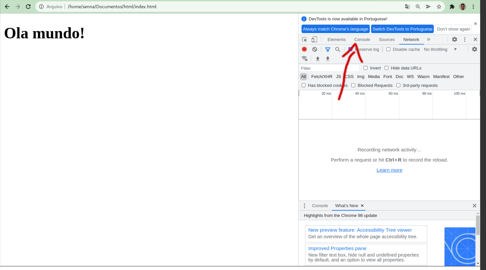
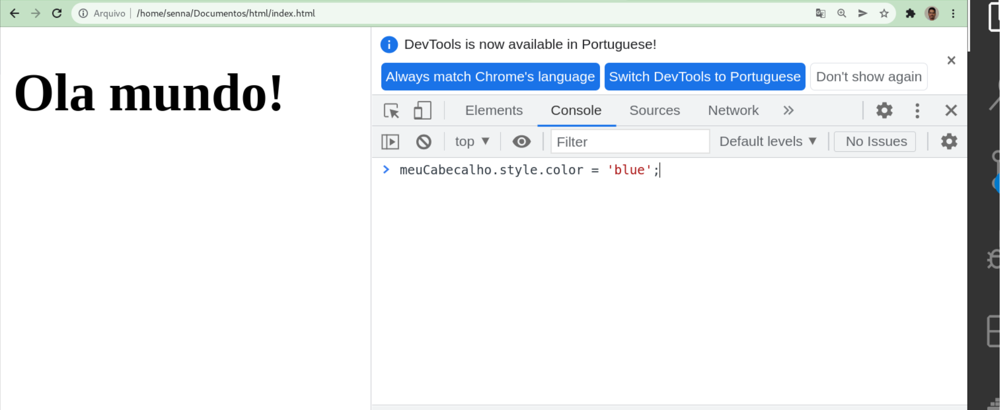
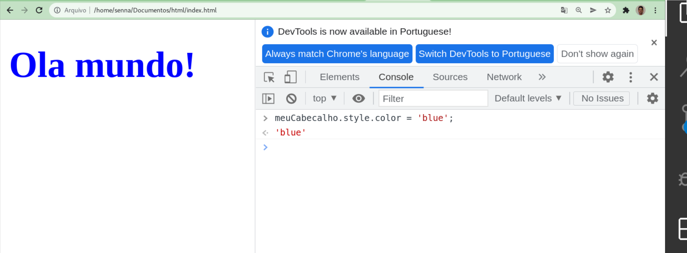
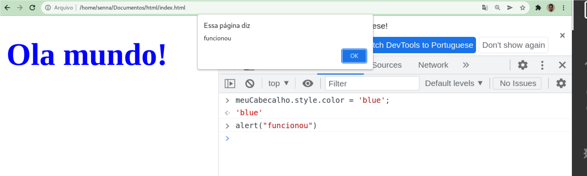

# 19 - Primeiro exemplo de JavaScript

## Primeiro exemplo em código

Primeiro temos que saber que a nossa página é representada por um objeto chamado *document*, e vamos utilizar ele para pegar os elementos do html e mudar as suas informações.

Vamos começar criando uma página simples e colocando um título nela nela. Copie o código abaixo no arquivo "index.html" em uma pasta vazia e abra no vscode.

```
<!DOCTYPE html>
<html>
    <head>
        <title>Meu site com js</title>
    </head>
    <body>
        <h1></h1>
        <p></p>
    </body>
</html>
```

Vamos utilizar o JavaScript para mexer com algumas coisas na nossa página. Mas vamos separar ele em outro arquivo. 

Vamos criar uma pasta chamada scripts e criar um  arquivo chamado main.js dentro dela.

Nesse arquivo vamos colocar o código abaixo:

```
let meuCabecalho = document.querySelector('h1');
meuCabecalho.textContent = 'Ola mundo!';
```

Abra o arquivo index.html em algum navegador, e você verá que o título ainda está vazio.

Isso aconteceu por que, assim como o css, o JavaScript precisa ser importado no HTML. Para isso utilizamos a tag \<script\> dentro da body (no css utilizamos a tag \<link\>).

Então vamos colocar esse código abaixo na linha antes da tag \</body\>:

```
<script src="scripts/main.js"></script>
```

Salve os arquivos e tente recarregar eles no navegador. Se tudo der certo, você verá uma página com o título "Ola mundo!".

## Rodando o JavaScript no navegador

O JavaScript pode ser rodado direto no navegador. Vamos utilizar o Chrome para isso, mas esse processo funciona em outros navegadores.

No navegador onde você abriu o HTML que acabou de criar, aperte F12 para abrir as ferramentas de desenvolvedor. Procure uma aba chamada console e clicke nela.



No console digite esse código em JS:

```
meuCabecalho.style.color = 'blue';
```



Aperte enter e a cor do texto vai mudar para azul.



O **meuCabecalho** vai existir nesse terminal por que ele foi criado pelo main.js quando a página foi carregada. 

Podemos utilizar o document nesse terminal para pegar outros elementos da página.

Como último teste, vamos criar um alert na nossa página digitando esse código no terminal:

```
alert("funcionou")
```

Aparecerá um alerta na tela como o da figura abaixo:

