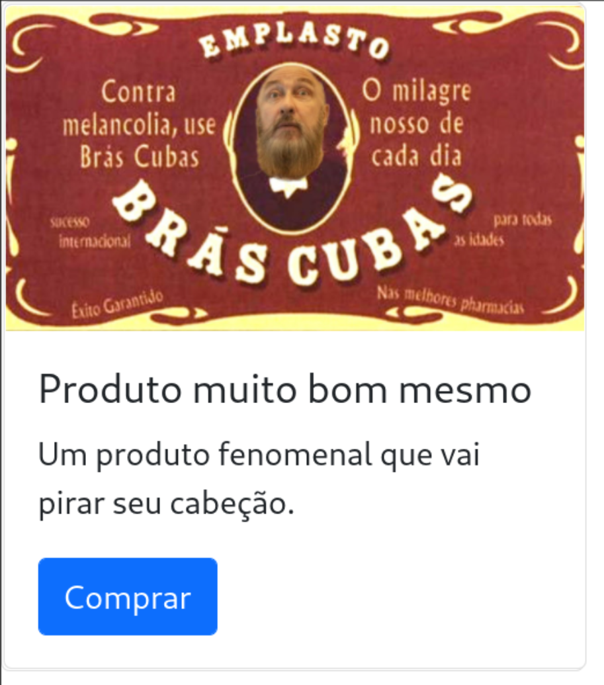

# 21 - Eventos com JS

Nessa aula vamos ver o que são eventos e como utilizar eles para deixar a nossa página mais dinâmica.

## Eventos

Os elementos do HTML possuem eventos, eles são chamados quando alguma ação acontece (ex: o mouse passa por cima do elemento) e podemos colocar código em javascript para ser executado.

Normalmente vamos utilizar funções para organizar e reaproveitar o nosso código.

Exemplo de eventos: [link](https://www.w3schools.com/js/js_events.asp)

Lista de eventos: [link](https://www.w3schools.com/tags/ref_eventattributes.asp)

## Exemplo

Vamos criar um card de venda de produtos que quando o usuário retira o mouse do botão de compra, ele muda o texto. Vamos começar criando o html.

```
<!DOCTYPE html>
<html>
    <head>
        <link href="https://cdn.jsdelivr.net/npm/bootstrap@5.1.3/dist/css/bootstrap.min.css" rel="stylesheet" integrity="sha384-1BmE4kWBq78iYhFldvKuhfTAU6auU8tT94WrHftjDbrCEXSU1oBoqyl2QvZ6jIW3" crossorigin="anonymous">
        <script type="text/javascript" src="scripts/compra.js"></script>
    </head>
    <body>
        <div class="card" style="width: 18rem;">
            <div class="card" style="width: 18rem;">
                
                <div class="card-body">
                  <h5 class="card-title">Produto muito bom mesmo</h5>
                  <p class="card-text">Um produto fenomenal que vai pirar seu cabeção.</p>
                  <a href="#" class="btn btn-primary" onmouseout="naoDesista()" onmouseover="ultimasUnidades()">Comprar</a>
                </div>
            </div>
    </body>
</html>
```

Na mesma pasta dele cria as pastas scripts e imgs e coloque uma imagem para completar o seu card como nessa imagem.



Na pasta scripts vamos criar o arquivo *compra.js* e nele vamos criar duas funções, uma para ser chamada quando o usuário tirar o mouse do botão de compra (naoDesista) e outro para quando ele colocar o mouse sobre o botão (ultimasUnidades).

```
function naoDesista(e) {
    var target = e.target;
    target.textContent = "Não vá embora"
}

function ultimasUnidades(e) {
    var target = e.target;
    target.textContent = "Nosso estoque está acabando, compre agora!!!"
}
```

Quando o mouse entrar ou sair do botão, o texto do botão vai mudar.