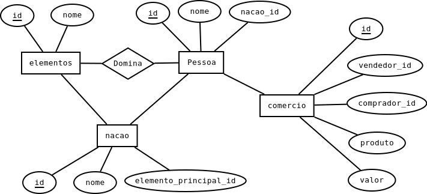

# Revisão de SQL: SELECT


Nessa aula vamos utilizar esse banco de dados: [avatar.sql](./sql/avatar.sql)


## Estrutura do banco

O banco possui a estrutura abaixo.




## SELECT

[Referência](https://dev.mysql.com/doc/refman/8.0/en/select.html)


### Primeira consulta
Listar todas as pessoas

```
SELECT * FROM pessoas;
```

Resultado

```
+----+--------+----------+
| id | nome   | nacao_id |
+----+--------+----------+
|  1 | Aang   |        5 |
|  2 | Katara |        2 |
|  3 | Sokka  |        2 |
|  4 | Zuko   |        1 |
|  5 | Toph   |        4 |
|  6 | Paku   |        3 |
|  7 | Suki   |        4 |
|  8 | Iron   |        1 |
|  9 | Hakoda |        2 |
| 10 | Roku   |        1 |
| 11 | kyoshi |        4 |
+----+--------+----------+
```

### Condições
Procurar todas as pessoas que o nome começa ou termina com A

```
SELECT * 
    FROM pessoas
    WHERE nome LIKE "A%" OR nome LIKE "%a";
```

Resultado

```
+----+--------+----------+
| id | nome   | nacao_id |
+----+--------+----------+
|  1 | Aang   |        5 |
|  2 | Katara |        2 |
|  3 | Sokka  |        2 |
|  9 | Hakoda |        2 |
+----+--------+----------+
```

### Join
Vamos criar um sql que apresente somente o nome da pessoa e a nação que ele pertence.

```
SELECT p.nome, n.nome
    FROM pessoas AS p
    JOIN nacoes as n ON p.nacao_id = n.id;
```

Resultado

```
+--------+-----------------------+
| nome   | nome                  |
+--------+-----------------------+
| Aang   | Nomades do ar         |
| Katara | Tribo da gua do sul   |
| Sokka  | Tribo da gua do sul   |
| Zuko   | Nacao do fogo         |
| Toph   | Reino da terra        |
| Paku   | Tribo da gua do norte |
| Suki   | Reino da terra        |
| Iron   | Nacao do fogo         |
| Hakoda | Tribo da gua do sul   |
| Roku   | Nacao do fogo         |
| kyoshi | Reino da terra        |
+--------+-----------------------+
```

### Ordenando

Vamos criar um sql que apresente somente o nome da pessoa e a nação que ele pertence, ordenando pelo nome da nação.

```
SELECT p.nome, n.nome
    FROM pessoas AS p
    JOIN nacoes as n ON p.nacao_id = n.id
    ORDER BY n.nome;
```

Resultado

```
+--------+-----------------------+
| nome   | nome                  |
+--------+-----------------------+
| Iron   | Nacao do fogo         |
| Zuko   | Nacao do fogo         |
| Roku   | Nacao do fogo         |
| Aang   | Nomades do ar         |
| kyoshi | Reino da terra        |
| Suki   | Reino da terra        |
| Toph   | Reino da terra        |
| Paku   | Tribo da gua do norte |
| Hakoda | Tribo da gua do sul   |
| Katara | Tribo da gua do sul   |
| Sokka  | Tribo da gua do sul   |
+--------+-----------------------+
```

### Agrupando pela nação
Vamos contar quantas pessoas cada nação possui.

```
SELECT n.nome AS 'nacao', COUNT(*) AS 'populacao'
    FROM nacoes AS n
    JOIN pessoas AS p ON n.id = p.nacao_id
    GROUP BY n.id; 
```

Resultado

```
+-----------------------+-----------+
| nacao                 | populacao |
+-----------------------+-----------+
| Nacao do fogo         |         3 |
| Tribo da gua do sul   |         3 |
| Tribo da gua do norte |         1 |
| Reino da terra        |         3 |
| Nomades do ar         |         1 |
+-----------------------+-----------+
```

### Limitando a quantidade de respostas

```
SELECT p.nome, n.nome
    FROM pessoas AS p
    JOIN nacoes as n ON p.nacao_id = n.id
    LIMIT 4;
```

## Procurando os avatares


Precisamos encontrar os avatares cadastrados no banco de dados. Como regra, os avatares são os únicos personagens capazes de dominar mais de um elemento.

Com essa informação, podemos fazer um join das pessoas com os elementos e agrupar as respostas pelas pessoa. Dessa forma, podemos utizar a função de agregação COUNT para saber quantos elementos cada pessoa domina.

Para criarmos condições utilizado agregações, utilizamos o HAVING.

```
SELECT * FROM pessoas AS p 
    JOIN pessoa_elemento AS pe on p.id = pe.pessoa_id
    GROUP BY p.id 
    HAVING COUNT(elemento_id) = 4;
```


## Concatenando as respostas de uma agregação

```
SELECT p.nome, COALESCE(Group_CONCAT(e.nome), 'Nenhum') AS elementos 
    FROM pessoas as p 
    LEFT JOIN pessoa_elemento AS pe ON p.id = pe.pessoa_id 
    LEFT JOIN elementos AS e ON pe.elemento_id = e.id
    GROUP BY p.id;
```

```
+--------+--------------------+
| nome   | elementos          |
+--------+--------------------+
| Aang   | Fogo,Agua,Terra,Ar |
| Katara | Agua               |
| Sokka  | Nenhum             |
| Zuko   | Fogo               |
| Toph   | Terra              |
| Paku   | Agua               |
| Suki   | Nenhum             |
| Iron   | Fogo               |
| Hakoda | Nenhum             |
| Roku   | Fogo,Agua,Terra,Ar |
| kyoshi | Fogo,Agua,Terra,Ar |
+--------+--------------------+


```

## Atividades

1. Crie uma consulta para descobrir quais pessoas não dominam nenhum elemento.

2. Crie uma consulta para descobrir quantas pessoas participaram de duas ou mais transações comerciais.

3. Crie uma consulta para mostrar quanto cada nação vendeu (a soma das vendas das pessoas da nação).

# Desafio "Boa de prova ;)"

1. Crie uma consulta para listar a "balança comercia" de cada uma das pessoas, mostrando o total do valor de compras, de vendas e a diferença entre eles. Como no exemplo abaixo.

```
+--------+--------------+---------------+-----------+
| Nome   | Total_Vendas | Total_Compras | Resultado |
+--------+--------------+---------------+-----------+
| Aang   |           25 |             0 |        25 |
| Hakoda |           59 |             0 |        59 |
| Iron   |            0 |             0 |         0 |
| Katara |           56 |            57 |        -1 |
| kyoshi |            0 |             0 |         0 |
| Paku   |            0 |            22 |       -22 |
| Roku   |            0 |             0 |         0 |
| Sokka  |          110 |             0 |       110 |
| Suki   |            0 |            10 |       -10 |
| Toph   |           22 |           115 |       -93 |
| Zuko   |           32 |           100 |       -68 |
+--------+--------------+---------------+-----------+
```