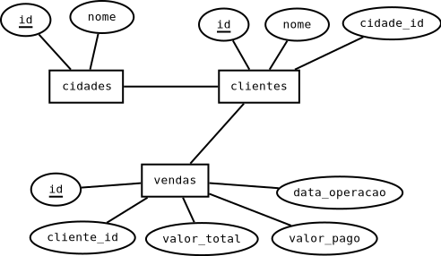

# Join e agregação

## Banco de dados

Nessa aula vamos utilizar esse banco de dados: [empresa.sql](./sql/empresa.sql)



## Join

Utilizamos o JOIN quando queremos juntar lado a lado duas tabelas. 

Normalmente fazemos isso juntando as linhas que possuem alguma relação entre elas.

No nosso banco, se quisermos mostrar o nome dos clientes e das cidades na mesma consulta, temos que juntar as duas tabelas, juntando as linhas onde o id da cidade seja igual ao cidade_id do cliente. 

### Tipos de JOIN

Nós temos alguns tipos de JOINs disponíveis, e vamos escolher qual utilizar dependendo dos dados que queremos mostrar na consulta.


Por padrão, o MySQL utiliza o INNER JOIN quando não especificamos qual tipo de join queremos fazer. No inner só serão retornadas as linhas que existem correspondentes nas duas tabelas. Caso nó façamos um join entre os clientes e as cidades com esse tipo de join, não serão mostradas as linhas com as cidades que não possuem nenhum cliente, nem as linhas dos clientes que não possuem cidade(nesse banco a cidade não pode ser nula, então isso não vai acontecer).

```
 SELECT cli.nome, cid.nome  
    FROM clientes AS cli 
    JOIN cidades AS cid ON cli.cidade_id = cid.id;

+---------------+----------+
| nome          | nome     |
+---------------+----------+
| Joao          | Umuarama |
| Ze            | Umuarama |
| Maria         | Umuarama |
| Bob esponja   | Umuarama |
| Goku          | Maringa  |
| Bulma         | Maringa  |
| Leia          | Londrina |
| Luke          | Londrina |
| Anakin        | Londrina |
| Tony Gordo    | Cascavel |
| Aldo o apache | Xambre   |
| Hans Landa    | Xambre   |
+---------------+----------+

```

Caso queiramos manter na resposta as cidades que não possuem nenhum cliente, podemos utilizar o RIGHT ou o LEFT JOIN, dependendo do lado onde a tabela está. Na consulta anterior, a cidade estava no lado direito, então podemos utilizar o RIGHT JOIN. Agora aparecem cidades com clientes NULL.

```
 SELECT cli.nome, cid.nome  
    FROM clientes AS cli 
    RIGHT JOIN cidades AS cid ON cli.cidade_id = cid.id;

+---------------+----------------+
| nome          | nome           |
+---------------+----------------+
| Tony Gordo    | Cascavel       |
| NULL          | Cedro          |
| Leia          | Londrina       |
| Luke          | Londrina       |
| Anakin        | Londrina       |
| Goku          | Maringa        |
| Bulma         | Maringa        |
| NULL          | Mundo Novo     |
| NULL          | Navirai        |
| NULL          | Nova Andradina |
| NULL          | Toledo         |
| Joao          | Umuarama       |
| Ze            | Umuarama       |
| Maria         | Umuarama       |
| Bob esponja   | Umuarama       |
| Aldo o apache | Xambre         |
| Hans Landa    | Xambre         |
+---------------+----------------+
```

Um último join interessante é quando queremos retornar apenas a linhas de uma tabela quando não existirem relações entre ela e a outra tabela. Por exemplo, se quisermos mostrar todas as cidades que não possuem clientes, posemos fazer a sequinte consulta:

```
SELECT cid.nome
    FROM cidades AS cid
    LEFT JOIN clientes AS cli ON  cid.id = cli.cidade_id
    WHERE cli.id IS NULL;

+----------------+
| nome           |
+----------------+
| Cedro          |
| Mundo Novo     |
| Navirai        |
| Nova Andradina |
| Toledo         |
+----------------+
```


## Agregação

A agregação é uma função muito útil do SQL que nos permite juntar as linhas que possuem alguma informação em comum em uma única linha. Com isso, podemos fazer operações com os dados dessas linhas que foram "juntadas" e obter informações como a quantidade de linhas que se juntaram, a soma ou a média de algum valor ou fazer alguma operação com esses valores.

### GROUP BY

Para fazer a agregação, utilizamos o GROUP BY e passamos uma ou mais colunas. 

Todas as linhas que essas colunas possuirem o mesmo valor sejão unidas em uma única linha. Caso passemos mais de uma linha, todas devem ter o mesmo valor para que as linhas sejam unidas.

Vamos começar fazendo uma agregação apenas com a tabela vendas.

Vamos juntar todas as vendas que aconteceram no mesmo dia.

```
SELECT * 
    FROM vendas as v
    GROUP BY v.data_operacao;

+----+------------+-------------+------------+---------------+
| id | cliente_id | valor_total | valor_pago | data_operacao |
+----+------------+-------------+------------+---------------+
|  1 |          1 |         100 |         20 | 2022-01-01    |
|  2 |          2 |         200 |        120 | 2022-02-01    |
|  3 |          2 |         300 |        245 | 2022-03-01    |
|  4 |          5 |         200 |        200 | 2022-04-01    |
+----+------------+-------------+------------+---------------+
```

Reparem que o MySQL pega as informações da primeira linha de cada grupo. Alguns bancos não permitem que mostremos colunas que não estejam no GROUP BY ou sejam usadas por alguma função.

Se quisermos juntar as linhas que possuem a mesma data e o mesmo valor total, podemos fazer essa consulta:

```
SELECT * 
    FROM vendas as v
    GROUP BY v.data_operacao, valor_total;

+----+------------+-------------+------------+---------------+
| id | cliente_id | valor_total | valor_pago | data_operacao |
+----+------------+-------------+------------+---------------+
|  1 |          1 |         100 |         20 | 2022-01-01    |
|  9 |          3 |         300 |        220 | 2022-01-01    |
| 10 |          3 |         100 |         90 | 2022-02-01    |
|  2 |          2 |         200 |        120 | 2022-02-01    |
|  6 |          5 |         300 |         80 | 2022-02-01    |
| 19 |         12 |         100 |         20 | 2022-03-01    |
|  7 |          7 |         200 |        120 | 2022-03-01    |
|  3 |          2 |         300 |        245 | 2022-03-01    |
|  4 |          5 |         200 |        200 | 2022-04-01    |
+----+------------+-------------+------------+---------------+
```

### Funções de agregação

São funções que recebem valores de uma coluna do grupo e retorna um único valor.

* MAX(coluna): Retorna o maior valor que existir nessa coluna para o grupo.
* MIN(coluna): Retorna o menor valor que existir nessa coluna para o grupo.
* SUM(coluna): Retorna a soma de todos os valores da coluna no grupo.
* AVG(coluna): Retorna a média de todos os valores da coluna no grupo.
* COUNT(coluna): Retorna a quantidade de valores existentes (não nulos) para essa coluna no grupo.

Vamos testar isso agrupando as vendas por data e mostrando o mínimo, máximo e média do valor_total das operações na data:

```
SELECT data_operacao AS 'data', 
    MIN(valor_total) AS 'menor valor', 
    MAX(valor_total) as 'maior valor', 
    AVG(valor_total) as 'valor medio'
    FROM vendas as v
    GROUP BY v.data_operacao;

+------------+-------------+-------------+-------------+
| data       | menor valor | maior valor | valor medio |
+------------+-------------+-------------+-------------+
| 2022-01-01 |         100 |         300 |         150 |
| 2022-02-01 |         100 |         300 |         200 |
| 2022-03-01 |         100 |         300 |         200 |
| 2022-04-01 |         200 |         200 |         200 |
+------------+-------------+-------------+-------------+
```

### HAVING

O having funciona como um WHERE onde podemos fazer condições com as funçõe de agregação. Na consulta anterior, se quisermos apenas os dias que o valor média seja igual ou maior que 200, podemos utilizar o having.

```
SELECT data_operacao AS 'data', 
    MIN(valor_total) AS 'menor valor', 
    MAX(valor_total) as 'maior valor', 
    AVG(valor_total) as 'valor medio'
    FROM vendas as v
    GROUP BY v.data_operacao
    HAVING AVG(valor_total) >= 200;

+------------+-------------+-------------+-------------+
| data       | menor valor | maior valor | valor medio |
+------------+-------------+-------------+-------------+
| 2022-02-01 |         100 |         300 |         200 |
| 2022-03-01 |         100 |         300 |         200 |
| 2022-04-01 |         200 |         200 |         200 |
+------------+-------------+-------------+-------------+
```

## Exemplos
Caso você tenha que mandar o seu "cobrador" para uma cidade, como podemos descobrir onde temos mais dinheiro a receber?


```
SELECT cid.*, SUM(v.valor_total - v.valor_pago) AS 'divida'
    FROM cidades AS cid
    JOIN clientes AS cli ON  cid.id = cli.cidade_id
    JOIN vendas AS v ON v.cliente_id = cli.id
    GROUP BY cid.id
    ORDER BY divida desc;

+----+----------+--------+
| id | nome     | divida |
+----+----------+--------+
|  1 | Umuarama |    720 |
|  2 | Maringa  |    610 |
|  5 | Xambre   |    210 |
|  3 | Londrina |     80 |
|  4 | Cascavel |     40 |
+----+----------+--------+
```


## Atividades

Utilizando o banco desta aula, faça as seguintes consultas:

* Mostre uma lista das cidades que a empresa possui algum cliente.

* Mostre a quantidade de clientes que a empresa possui em cada cidade.

```
+----------------+---------------------+
| cidade         | quantidade_clientes |
+----------------+---------------------+
| Umuarama       |                   4 |
| Maringa        |                   2 |
| Londrina       |                   3 |
| Cascavel       |                   1 |
| Xambre         |                   2 |
| Toledo         |                   0 |
| Navirai        |                   0 |
| Mundo Novo     |                   0 |
| Nova Andradina |                   0 |
| Cedro          |                   0 |
+----------------+---------------------+
```

* Mostre a quantidade de compras que cada cliente fez.

* Mostre o valor médio das compras por cidade, em ordem decrescente.

* A empresa quer descobrir quem é o melhor cliente(maior soma das compras) de janeiro em cada cidade para mandar um presente. Como podemos fazer uma consulta para ajudar o gerente nessa tarefa?