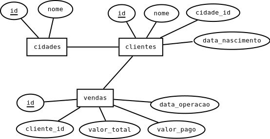

# Visões

## Banco de dados

Nessa aula vamos utilizar esse banco de dados: [empresa_2.sql](./sql/empresa_2.sql)



## Visões


As visões são estruturas que são criadas no banco de dados utilizando uma consulta como base. Elas são como tabelas virtuais.

Podemos utilizar elas para facilitar consultas ou gerar relatórios.

Por exemplo, sempre que quisermos ter os dados do cliente no nosso exemplo junto com o nome da cidade dele, precisamos fazer um JOIN. Mas se tivéssemos uma tabela com as seguintes informações:

```
+---------------+----------+
| nome          | cidade   |
+---------------+----------+
| Joao          | Umuarama |
| Ze            | Umuarama |
| Maria         | Umuarama |
| Bob esponja   | Umuarama |
| Goku          | Maringa  |
| Bulma         | Maringa  |
| Leia          | Londrina |
| Luke          | Londrina |
| Anakin        | Londrina |
| Tony Gordo    | Cascavel |
| Aldo o apache | Xambre   |
| Hans Landa    | Xambre   |
+---------------+----------+
```

Poderiamos 

### Visões materializadas

O MySQL não suporta esse tipo de visão, mas outros bancos podem suportar. São semelhantes às visões normais, mas elas são armazenadas no disco quando são criadas. O banco realiza a consulta que cria ela e armazena o resultado como se fosse uma tabela.

Os dados que ficam nesse tipo de view são os do momento que elas são criadas. Caso queiramos atualizar, temos que utilizar comandos para recarregar ela.

## Criando uma VIEW

Criar uma view é fácil como voar, só precisamos utilizar essa estrutura:

```
CREATE VIEW minha_view
    AS
        ALGUM_SELECT
```

Onde o ALGUM_SELECT é uma consulta e o minha_view é o nome da view. Podemos utilizar essa view como se fosse uma tabela com esse nome em um from de uma consulta.

## Dados dos clientes em uma "tabela"

Se em algum lugar do nosso sistema, precisarmos mostrar a idade dos clientes, podemos fazer essa consulta assim:

```
SELECT *, TIMESTAMPDIFF(YEAR, data_nascimento, CURDATE()) AS 'idade'
    FROM clientes;
```

Nesse caso, estamos fazendo um cálculo com apenas 1 atributo, se tivermos mais informações diferentes para pegarmos dos clientes, essa consulta pode ficar grande, não sendo legal colocar ela no nosso código do backend.

Podemos criar uma visão com mais dados do cliente com o código abaixo:

```
CREATE VIEW clientes_relatorio
    AS
        SELECT cli.nome AS 'nome', 
            cid.nome AS 'cidade', 
            COUNT(ve.valor_total) AS 'venda', 
            COALESCE(SUM(valor_total), 0) AS 'valor_vendas',
            COALESCE(SUM(valor_total - valor_pago),0) AS 'valor_a_pagar',
            TIMESTAMPDIFF(YEAR, data_nascimento, CURDATE()) AS 'idade'
        FROM
            clientes AS cli
            JOIN cidades AS cid ON cli.cidade_id = cid.id
            LEFT JOIN vendas AS ve ON ve.cliente_id = cli.id
        GROUP BY cli.id;
```

Assim podemos ter todos vários dados dos nossos clientes de uma forma mais fácil, como se existisse uma tabela com esse dados. Podemos rodar o comando abaixo e ter todos esse dados.

```
SELECT * FROM clientes_relatorio;

+---------------+----------+-------+--------------+---------------+-------+
| nome          | cidade   | venda | valor_vendas | valor_a_pagar | idade |
+---------------+----------+-------+--------------+---------------+-------+
| Joao          | Umuarama |     2 |          300 |           135 |    30 |
| Ze            | Umuarama |     4 |         1000 |           395 |    22 |
| Maria         | Umuarama |     3 |          500 |           140 |    11 |
| Bob esponja   | Umuarama |     1 |          200 |            50 |    25 |
| Goku          | Maringa  |     4 |          900 |           580 |    16 |
| Bulma         | Maringa  |     1 |          100 |            30 |    22 |
| Leia          | Londrina |     1 |          200 |            80 |    16 |
| Luke          | Londrina |     0 |            0 |             0 |    18 |
| Anakin        | Londrina |     0 |            0 |             0 |  1821 |
| Tony Gordo    | Cascavel |     1 |          100 |            40 |     9 |
| Aldo o apache | Xambre   |     1 |          200 |           130 |    30 |
| Hans Landa    | Xambre   |     1 |          100 |            80 |    30 |
+---------------+----------+-------+--------------+---------------+-------+
```

Essa nova visão que criamos se comporta como uma tabela, então, se quisermos encontrar os clientes com idade menor que 18 para enviarmos presentes do dia da criança, podemos fazer por essa visão.

```
SELECT * 
    FROM clientes_relatorio
    WHERE idade < 18;

+------------+----------+-------+--------------+---------------+-------+
| nome       | cidade   | venda | valor_vendas | valor_a_pagar | idade |
+------------+----------+-------+--------------+---------------+-------+
| Maria      | Umuarama |     3 |          500 |           140 |    11 |
| Goku       | Maringa  |     4 |          900 |           580 |    16 |
| Leia       | Londrina |     1 |          200 |            80 |    16 |
| Tony Gordo | Cascavel |     1 |          100 |            40 |     9 |
+------------+----------+-------+--------------+---------------+-------+
```

## Atividade

Dica: faça o select primeiro, quando tiver o select que funcione, crie a view.

* crie uma visão contendo o nome do cliente e o nome da cidade.

```
select * from visao;
+---------------+----------+
| nome          | cidade   |
+---------------+----------+
| Joao          | Umuarama |
| Ze            | Umuarama |
| Maria         | Umuarama |
| Bob esponja   | Umuarama |
| Goku          | Maringa  |
| Bulma         | Maringa  |
| Leia          | Londrina |
| Luke          | Londrina |
| Anakin        | Londrina |
| Tony Gordo    | Cascavel |
| Aldo o apache | Xambre   |
| Hans Landa    | Xambre   |
+---------------+----------+
```

* Crie uma visão contendo as vendas com o nome do cliente, o valor total e o valor a receber.

```
select * from visao;
+---------------+-------------+---------------+
| nome          | valor_total | valor_a_pagar |
+---------------+-------------+---------------+
| Joao          |         100 |            80 |
| Ze            |         200 |            80 |
| Ze            |         300 |            55 |
| Goku          |         200 |             0 |
| Bulma         |         100 |            30 |
| Goku          |         300 |           220 |
| Leia          |         200 |            80 |
| Goku          |         200 |           180 |
| Maria         |         300 |            80 |
| Maria         |         100 |            10 |
| Ze            |         200 |            80 |
| Joao          |         200 |            55 |
| Ze            |         300 |           180 |
| Bob esponja   |         200 |            50 |
| Goku          |         200 |           180 |
| Maria         |         100 |            50 |
| Tony Gordo    |         100 |            40 |
| Aldo o apache |         200 |           130 |
| Hans Landa    |         100 |            80 |
+---------------+-------------+---------------+
```

* Crie uma visão contendo o nome das cidades, quantidade de clientes na cidade, total de vendas na cidade e valor que temos a receber em cada cidade. 

```
select * from visao;
+----------------+---------------------+-------------------+
| nome           | quantidade_clientes | quantidade_vendas |
+----------------+---------------------+-------------------+
| Umuarama       |                   4 |                10 |
| Maringa        |                   2 |                 5 |
| Londrina       |                   3 |                 1 |
| Cascavel       |                   1 |                 1 |
| Xambre         |                   2 |                 2 |
| Toledo         |                   0 |                 0 |
| Navirai        |                   0 |                 0 |
| Mundo Novo     |                   0 |                 0 |
| Nova Andradina |                   0 |                 0 |
| Cedro          |                   0 |                 0 |
+----------------+---------------------+-------------------+
```