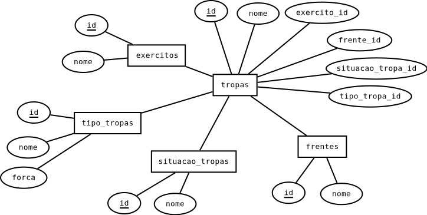

# Lista de revisão para a prova

## Banco de dados

Nessa aula vamos utilizar esse banco de dados: [star_wars.sql](./sql/star_wars.sql)

## Explicações

Nessa banco temos uma batalha nas guerras clonicas do universo de star wars.

* **exercitos:** São os exercitos que participaram da batalha, a República e a Federação do comércio.

* **tropas:** São os soldados que estão na batalha. Eles devem pertencer a um exercito.

* **frentes:** São as frentes de batalha. Em uma batalha podem existir mais de uma frente e uma tropa deve estar em algum deles.

* **tipo de tropa:** São os tipos das tropas em batalha e a força que elas possuem.

* **situação da tropa:** As tropas podem estar ativas ou inativas. As ativas ainda estão aptas ao combate.

## Lista

Utilizando esse banco, crie:

* Uma view que mostre quantas tropas no total cada exercito possui(sem detalhar se está ativa ou inativa).

* Uma view que mostre a quantidade de cada tipo de tropa no combate (sem detalhar se está ativa ou inativa).

* Uma view que mostre as frentes de combate e a quantidade de soldados ativos em cada uma delas.

* Uma view que mostre o nome do exercito, o nome das frentes de batalha e a força soma da força das tropas ativas do exercito nessa frente.

