# Utilizando o github no VSCode

Nessa aula, vamos criar um repositório no github e o utilizar pelo VSCode.

## Criando a conta

Primeiro vamos criar uma conta no github, quem já possui, vá para o próximo passo.

Entre no site [github.com](github.com). Clique em "SIGN UP" na tela inicial e siga os passos para criar a conta.

## Criando um repositório

Para criarmos um novo repositório no github, vamos logar na conta e, na página inicial ([github.com](github.com)), clickar em new como na imagem abaixo.

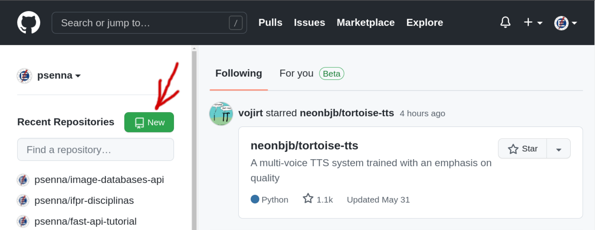

Na página de criação, primeiro crie um nome para o repositório, depois clique em criar repositório.

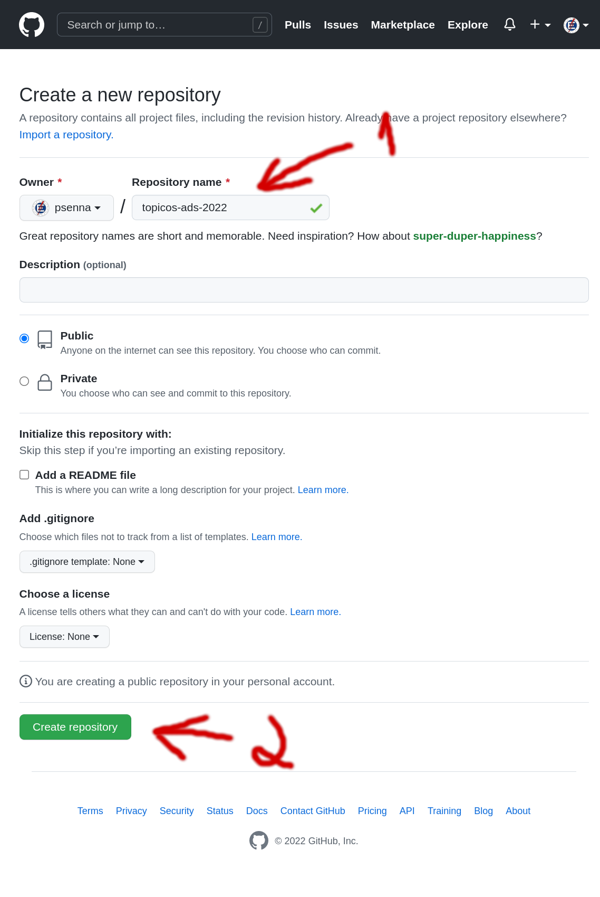

Depois disso, você terá criado um repositório público vazio.

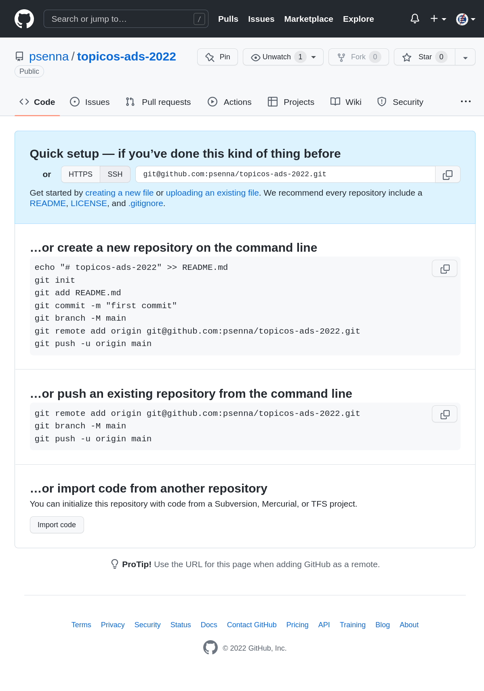

Agora vamos para o VSCode para baixar esse repositório na sua máquina.

## Baixando o repositório para sua máquina (git clone)

Abra o VSCode e precione ctrl + shist + p. Vai aparecer uma barra na parte superior da tela.

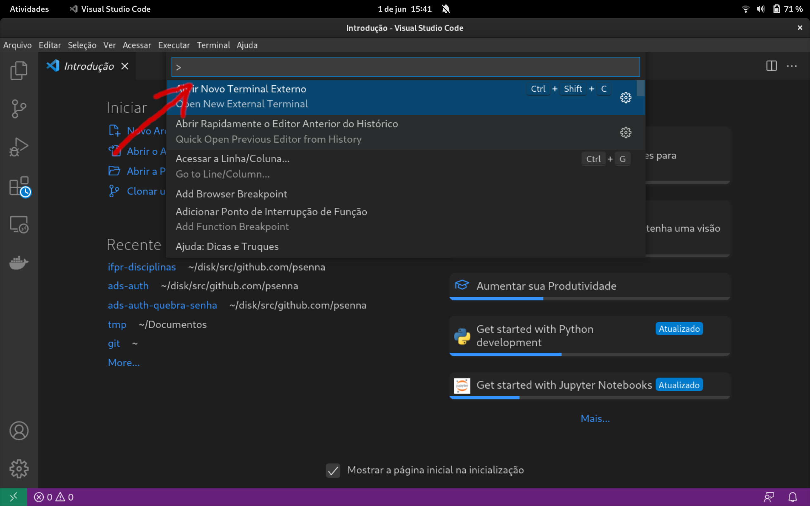

Nessa barra, digite "gitcl" e escolha a opção Clonar, como na imagem abaixo.

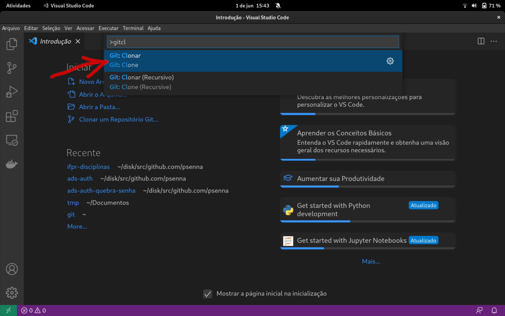

Agora vá para o repositório que você criou no passo anterior, selecione o HTTPS e copie a URL que aparecer, como na imagem abaixo.

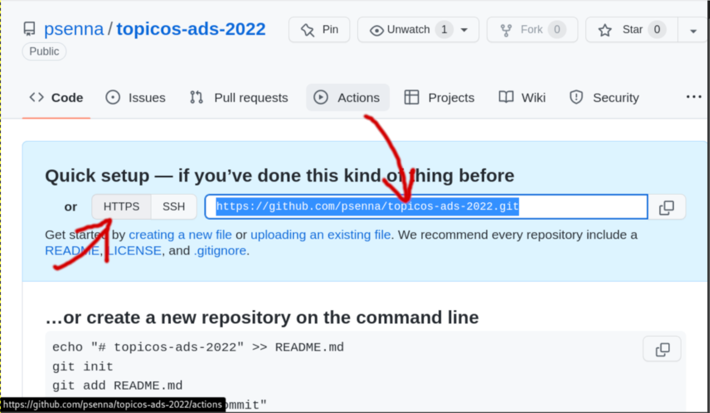

Cole a URL no menu do VScode como na imagem abaixo e clicke em "clonar da URL":

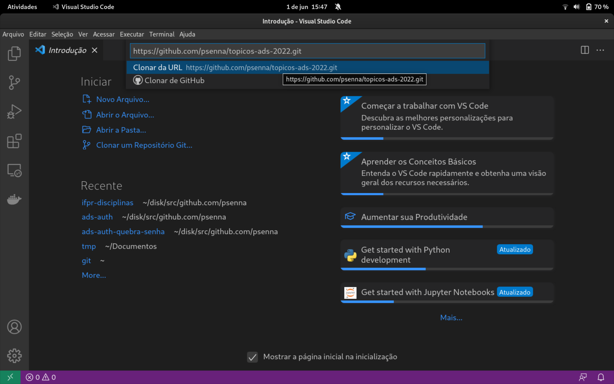

Vai aparecer uma janela para escolherem em qual pasta o repositório deve ser criado.

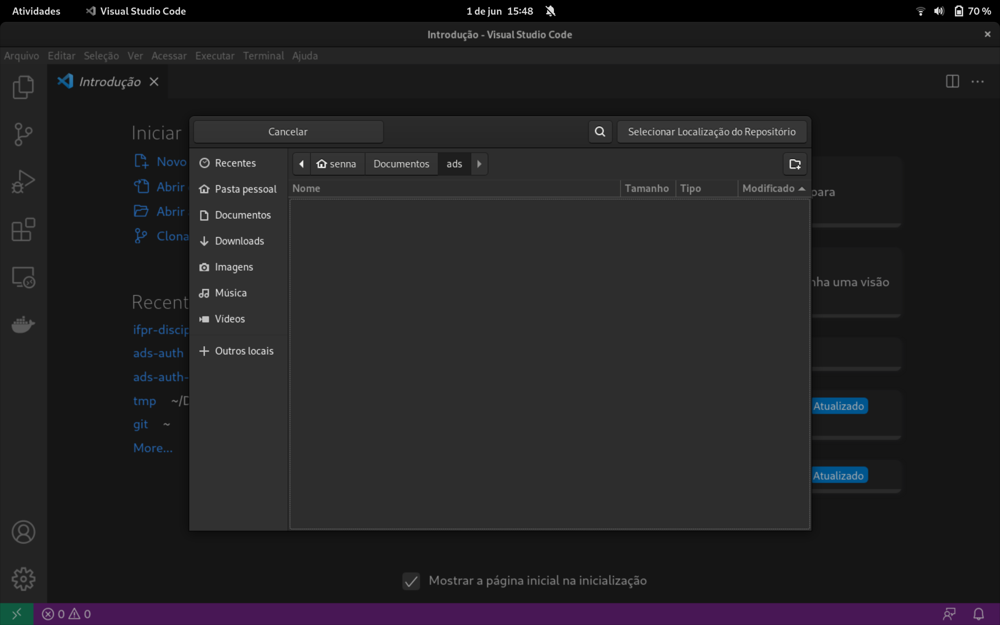

Depois clique em abrir.

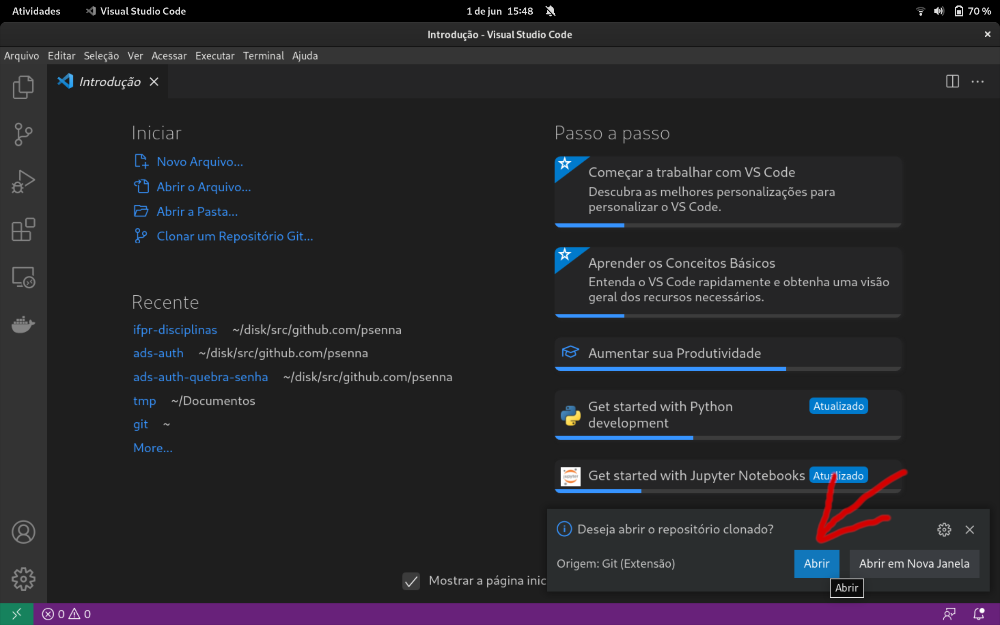

## Adicionando o primeiro código

Crie algum arquivo no repositório que acabou de criar.

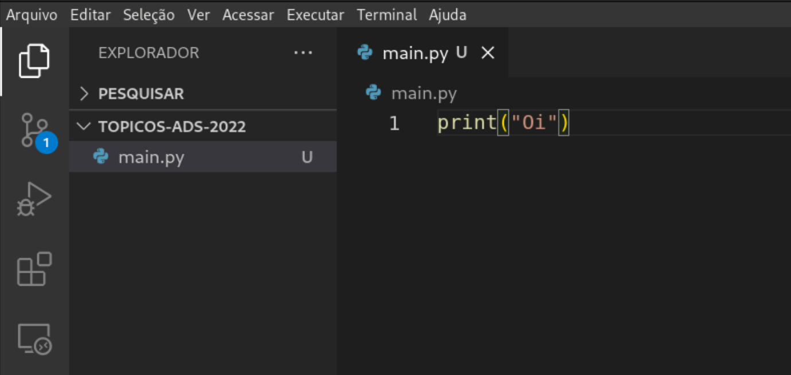

Quando quiser adicionar o arquivo no git, clique no menu de controle de versão:

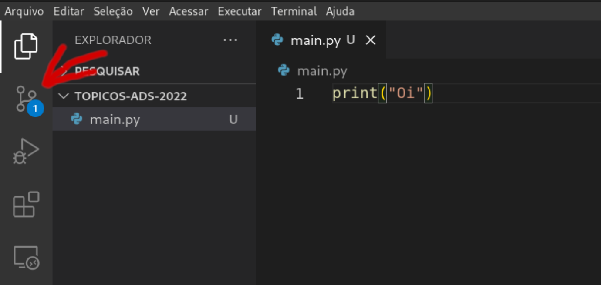

Na aba de controle de versão, ecolha os arquivos que deseja mandar para o git clicando no +.

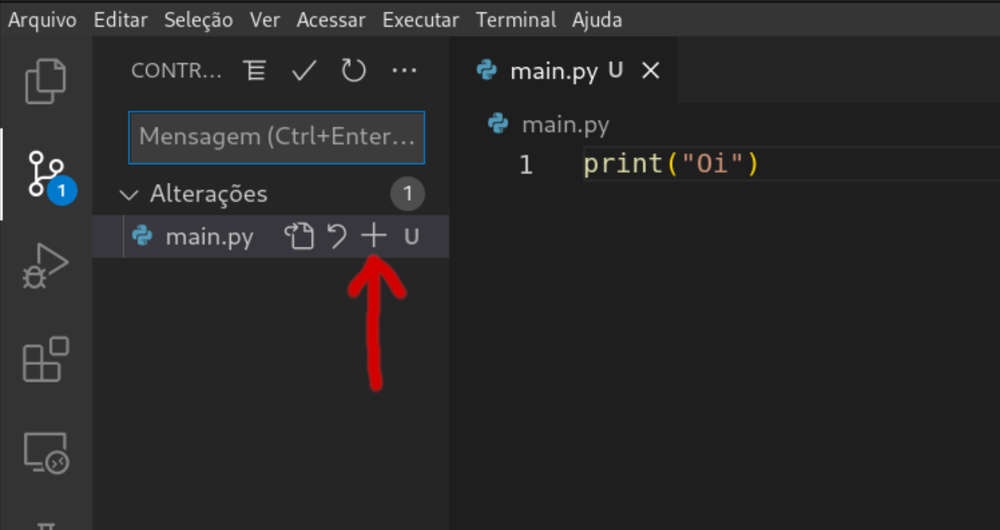

Clique no confirmar para criar um commit com os arquivos que foram adicionados.

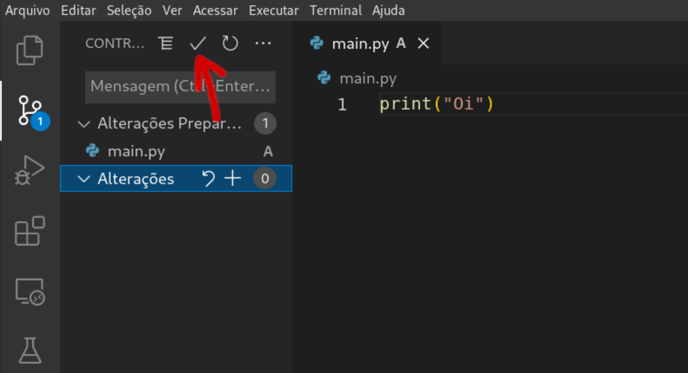

Vai aparecer um campo para escrever a mensagem do commit (dizer o que esse commit está fazendo).

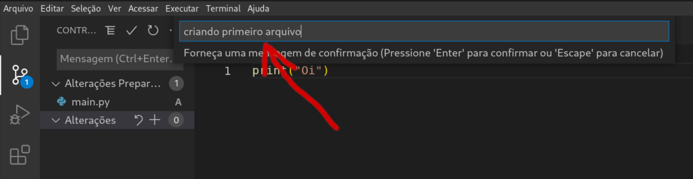

O commit está gravado apenas na sua máquina, olhe no github e o arquivo novo não vai estar lá.

Para enviar os commit parar o github, vamos escolher a opção "enviar por push".

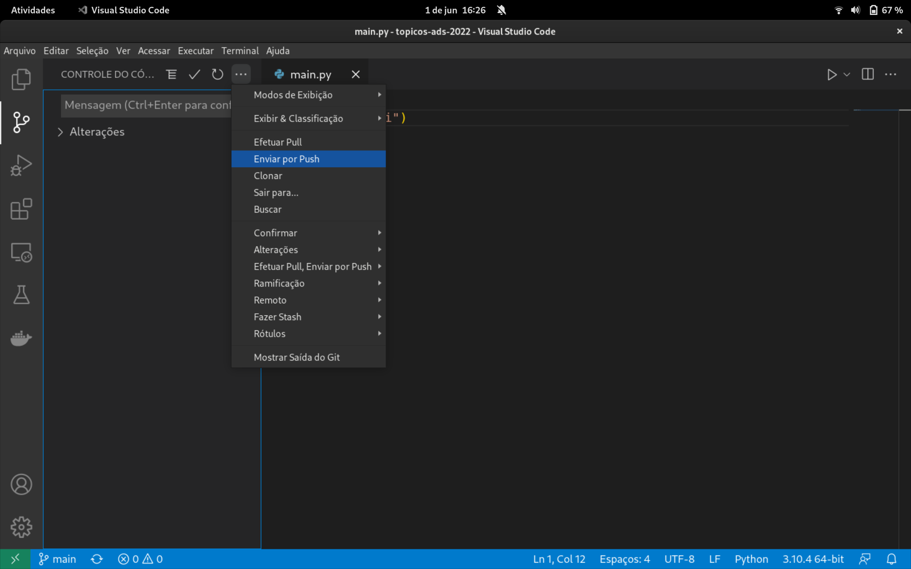

Ele vai pedir para fazer login no github e vai enviar as mudanças para o repositório.

## Pegando as mudanças no repositório

Para pegar as mudanças que estão no github, clique no botão na barra inferior.

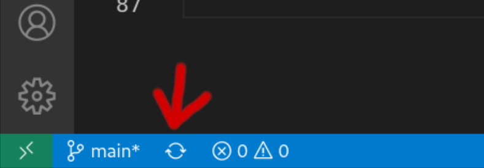